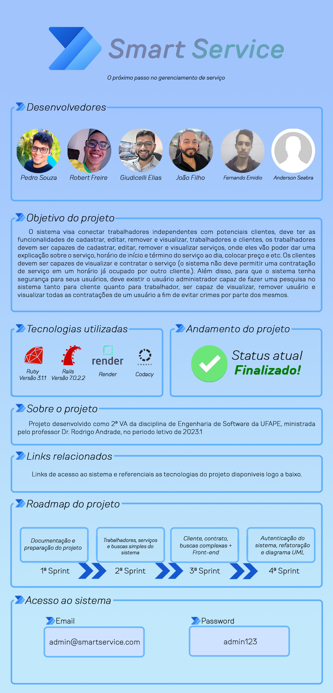

## 🔗 Links relacionados
*   [Ruby](https://www.ruby-lang.org/pt/)
*   [Rails](https://rubyonrails.org)
*   [Render](https://render.com)
*   [Codacy](https://app.codacy.com/)
*   [Site do projeto no RENDER](https://smartservice.onrender.com/)
### 🚩 Qualidade do código

